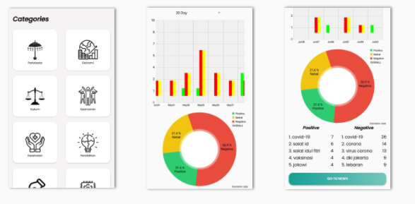

# Documentation Android App VizNewz B21-CAPO221

# Description

# Part of it
1. Erica R. Rubetta A2342252
2. Ilham Oktavian A3352996

# Job Description
sebelumnya mohon maaf dari tim android karena bekerja tim dengan metode lama yaitu 
dengan hanya transfer file manual.
1. Erica -> Membuat tampilan data dummy + Mengintegrasikan Dengan BackEnd
2. Ilham -> Membantu membuat tampilan + Membantu erika mengintegrasikan dengan BackEnd + Refactoring code

# How to run App using desktop
1. Download this repo or clone repo using `https://github.com/oktavian1/VizNewz.git`
2. Open it using android studio
3. Click Shift + f10 or Run App

# Feature
- Using MVVM (Model-View-ViewModel) Architecture
- Using Retrofit to request API Network
- Using Glide for load image from url
- Using MPAndroidChart for load GroupedBarChart and Pie Chart

# Next Update
1. Add Progress bar when fetching data from API
2. Implement Paging for News Activity